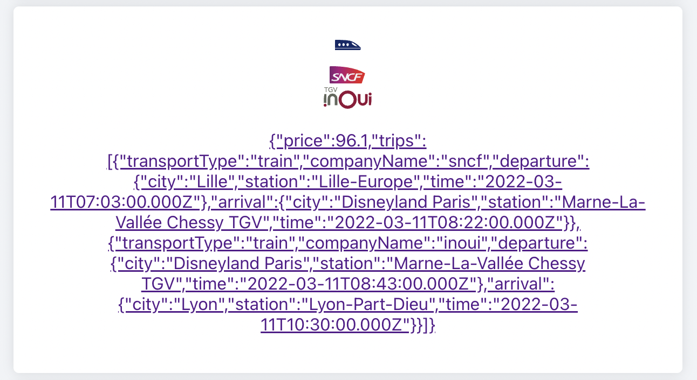
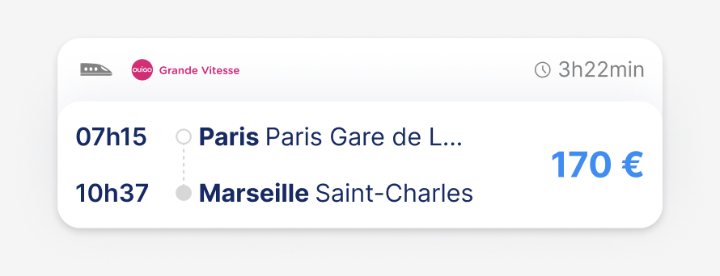
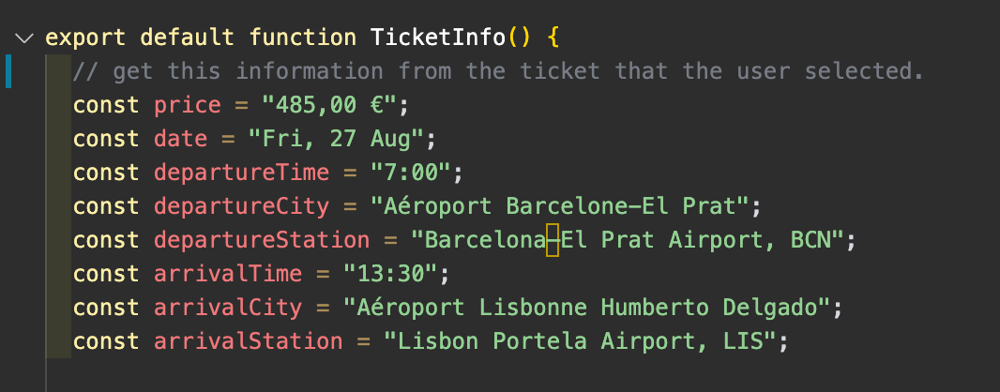
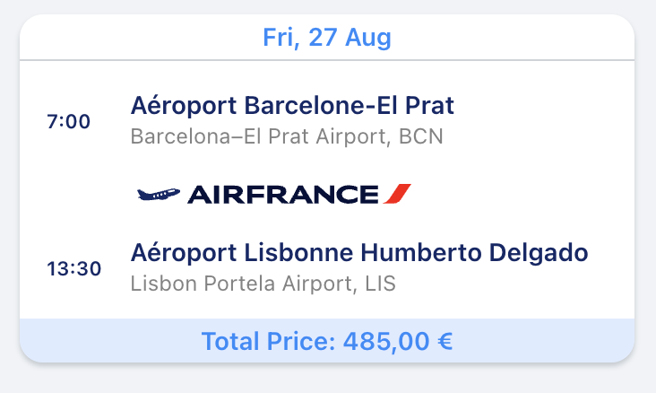

# kombo.co - Frontend technical test <!-- omit in toc -->
> ⚠️ STRICTLY CONFIDENTIAL ⚠️

First, if you are reading this, congratulations! It means that you may be joining the team. The objective of this test is to evaluate your skills and how you handle development tasks, so we can get a better understanding of your skills and how you can contribute to the team. 😊

We are looking for a frontend developer who is efficient in the following technologies:

* React
* Typescript
* CSS

Good luck, and have fun!

> ## 📖 Table of Contents <!-- omit in toc -->
- [Getting Started](#getting-started)
- [Test Objectives](#test-objectives)
  - [✨ Redesign](#-redesign)
  - [🔐 Implement](#-implement)
- [API Documentation](#api-documentation)

## Getting Started
1. `npm install`
2. `yarn start`

Please upload it to a public repository (on Github) and keep your commits organised so we can review your work. If you have any questions, feel free to reach out to pauline.coupez@kombo.co

## Test Objectives
We are giving you two (2) main tasks, and they can be tackled in any order. Do your best! It should take you between 3-5 hours, depending on your experience. Overall, we are looking to see how you can handle concepts our team deals with on a daily basis.

### ✨ Redesign
**Sample scenario**: we have a new [Figma design](https://www.figma.com/design/Rzu1vT1SVrRCn3RF8wZ2Ez/Front-design-test?node-id=0-1&t=YZQkz9LiFrgWh7IZ-1) for the tickets we sell on Kombo. We have already given you relevant ticket information from the API. Please implement your design changes however you see fit.

Relevant files:

* `src/components/TicketResult.tsx`
* `src/components/TicketResult.module.css`

| From this                                | to this                             |
| ---------------------------------------- | ----------------------------------- |
|  |  |

Here, we are looking for how you handle:

* CSS, variables, and general design
* Responsive development - mobile first, please!
* HTML structure

### 🔐 Implement
**Sample scenario**: We want to display more ticket details to the user after they have selected a ticket. The design is already done for you, but none of the information is called, connected, or displayed. Please implement the changes however you see fit.

Relevant files:

* `src/pages/TicketInfo.tsx`
* feel free to create additional files to organize your code.

| Uh oh! Static data!          | Dynamically display here:    |
| ---------------------------- | ---------------------------- |
|  |  |

Please keep in mind:

* Hooks, context, and other React tools
* Efficient API calls
* General component abstraction

## API Documentation
Type information can be found in `src/types.ts`. You only have one available endpoint for https://kombo-nextjs-api.vercel.app/api and we have already provided you with the necessary request with Axios in `src/service/api.ts`.

| METHOD | ENDPOINT   | RESPONSE                  |
| ------ | ---------- | ------------------------- |
| GET    | `/tickets` | array of `Ticket` objects |

